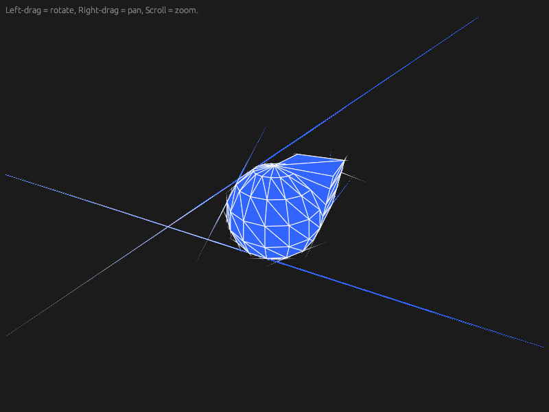

# egui-csgrs-demo

This is an example demo integrating csgrs with egui for rendering.  There is a "glinty" effect from the naieve approach taken to rendering, lacking Z culling.  Using a real renderer like Rend3, Three, mini/macroquad, kiss3d, etc is highly advised.
